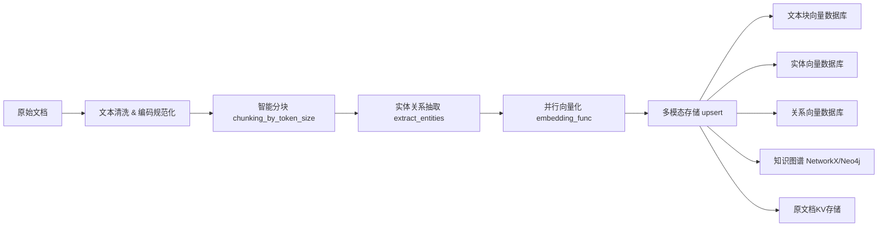

# WEB_RAG_PLUS (基于 LightRAG 的渐进式优化方案)

> **Simple, Fast & Extensible Retrieval-Augmented Generation Framework**  
> 原始框架来自香港大学开源项目 **[LightRAG](https://github.com/Mooler0410/light-rag)**。本仓库由 **@YoundonTsing** 在保留其核心思想的前提下，引入多项前沿 RAG 技术，对 *检索精度*、*响应效率*、*长文档处理* 与 *持续学习能力* 进行分阶段、非侵入式升级。

---
## 部署地址
http://117.72.180.197:5174/


**知识库上传知识材料支持：doc/html/pdf/txt/markdown.etc**


**LLM-RAG 流式响应**


**知识图谱实现**


**以上是效果展示**


## 目录速览
1. [代码设计架构](#代码设计架构)
2. [业务功能](#业务功能)
3. [技术栈](#技术栈)
4. [使用方法](#使用方法)
5. [技术细节与亮点](#技术细节与亮点)
6. [项目评价](#项目评价)
7. [优化展望](#优化展望)

---

## 代码设计架构


```

**核心设计原则**
- **模块化**：增强模块位于 `lightrag/enhancers/` 目录，可独立启用/停用。
- **非侵入**：对 `lightrag.py` 的改动最小化；旧接口不受影响。
- **渐进式**：优化分为 *Phase 1 → Phase 2 → Phase 3*，可按需迭代。

---

## 业务功能
| 功能 | 描述 | 相关模块 |
| --- | --- | --- |
| 多查询并行检索 | 对单一用户查询生成多语义变体并行检索，并通过 RRF 融合结果，提高召回率与鲁棒性 | `enhancers/multi_query.py` |
| 自适应上下文压缩 | 按查询复杂度动态裁剪上下文，减少 LLM token 消耗、降低延迟 | `enhancers/compression.py` |
| 分层索引 & 检索 | 基于 RAPTOR/LongRAG，构建树状索引，支持“粗→细”检索以应对长文档 | `enhancers/long_context.py` |
| 反馈收集与离线微调 | 收集用户反馈数据，定期微调嵌入模型，实现检索器自我演化 | `feedback_store/` & `finetuning/` |
| Web API & 图形 WebUI | FastAPI 提供 RESTful 接口；内置 React/Tailwind & Vue 前端示例 | `lightrag/api/`, `lightrag_webui/` |

---

## 技术栈
- **语言**：Python 3.10+, TypeScript/React/Vite (WebUI)
- **后端框架**：FastAPI · Gunicorn · AsyncIO
- **向量检索**：Milvus · Qdrant · FAISS · ElasticSearch (+Neo4j 图嵌入)
- **LLM 支持**：OpenAI / Azure OpenAI / Anthropic / LlamaIndex / LMDeploy / Ollama / Zhipu · 可自定义函数注入
- **数据存储**：MongoDB · Postgres · Redis · NetworkX in-memory
- **MLOps**：Sentence-Transformers · HuggingFace · PyTorch · k8s Helm Charts
- **DevOps**：Docker & Compose · GitHub Actions CI · Pre-commit · Poetry/TOML

---

## 使用方法

### 基础使用

```python
import asyncio
import os
from lightrag import LightRAG, QueryParam
from lightrag.llm.openai import gpt_4o_mini_complete, openai_embed

# 1. 初始化 LightRAG 实例
rag = LightRAG(
    working_dir="./rag_storage",           # 存储目录
    embedding_func=openai_embed,           # 嵌入函数
    llm_model_func=gpt_4o_mini_complete,   # LLM模型函数
    # 可选配置
    chunk_token_size=1024,                 # 文档分块大小
    chunk_overlap_token_size=128,          # 分块重叠大小
    top_k=20,                             # 检索结果数量
)

async def main():
    # 初始化存储
    await rag.initialize_storages()
    
    # 2. 文档注入 (Document Ingestion)
    with open("document.txt", "r") as f:
        await rag.ainsert(f.read())
    
    # 3. RAG 查询 (支持多种模式)
    # 基础向量检索
    answer = await rag.aquery(
        "What are the main themes?", 
        param=QueryParam(mode="naive")
    )
    
    # 知识图谱本地检索
    answer = await rag.aquery(
        "Who are the main characters?",
        param=QueryParam(mode="local")
    )
    
    # 知识图谱全局检索
    answer = await rag.aquery(
        "What's the overall narrative structure?",
        param=QueryParam(mode="global")
    )
    
    # 混合检索模式
    answer = await rag.aquery(
        "Complex analytical question",
        param=QueryParam(mode="hybrid")
    )

asyncio.run(main())
```

### API 服务器模式

```bash
# 启动 FastAPI 服务
cd lightrag/api
python lightrag_server.py

# 或使用 Gunicorn (生产环境)
python run_with_gunicorn.py
```

```python
# 客户端调用示例
import requests

# 文档上传
response = requests.post(
    "http://localhost:8080/insert",
    json={"input": "Your document content here"}
)

# 查询请求
response = requests.post(
    "http://localhost:8080/query",
    json={
        "query": "Your question",
        "mode": "hybrid",
        "stream": false
    }
)
```

### 高级配置

```python
# 支持多种存储后端
rag = LightRAG(
    vector_storage="MilvusStorage",        # Milvus 向量数据库
    graph_storage="Neo4jStorage",          # Neo4j 图数据库
    kv_storage="RedisStorage",             # Redis KV存储
    # 支持：FAISS, Qdrant, MongoDB, PostgreSQL 等
)

# 自定义 LLM 模型
from lightrag.llm.ollama import ollama_model_complete, ollama_embed

rag = LightRAG(
    llm_model_func=ollama_model_complete,
    embedding_func=ollama_embed,
    # 或使用 Azure OpenAI, Anthropic, Zhipu 等
)
```

---

## 技术细节与亮点

### 1. 智能文档摄取流程 (Document Ingestion Pipeline)



**核心技术亮点**：
- **自适应分块**：基于 Token 计数的智能分块，支持字符分割 + Token 分割混合策略
- **异步并行处理**：`asyncio.gather()` 实现向量化、图构建、存储的并行执行
- **增量更新**：通过 MD5 哈希去重，支持文档增量注入，避免重复处理

```python
# 核心分块算法 (lightrag/operate.py)
def chunking_by_token_size(
    tokenizer: Tokenizer,
    content: str,
    overlap_token_size: int = 128,
    max_token_size: int = 1024,
) -> list[dict]:
    tokens = tokenizer.encode(content)
    results = []
    for start in range(0, len(tokens), max_token_size - overlap_token_size):
        chunk_content = tokenizer.decode(tokens[start:start + max_token_size])
        results.append({
            "tokens": min(max_token_size, len(tokens) - start),
            "content": chunk_content.strip(),
            "chunk_order_index": index,
        })
    return results
```

### 2. 实体关系抽取与知识图谱构建

**LLM驱动的结构化抽取**：
```python
# 实体关系抽取 Prompt 工程
ENTITY_EXTRACTION_PROMPT = """
从文本中提取实体和关系，输出格式：
("实体1", "实体类型", "实体描述")
("实体1", "关系类型", "实体2", "关系强度", "关系描述")
"""
```

**技术亮点**：
- **多轮 Gleaning**：对模糊内容进行最多 `entity_extract_max_gleaning` 次提取尝试
- **实体合并与去重**：基于语义相似度的智能实体融合 (`merge_nodes_and_edges`)
- **动态图更新**：支持增量实体关系更新，维护图的一致性

### 3. 多模式检索策略 (Retrieval Strategies)

#### Naive 模式 - 纯向量检索
```python
async def naive_query(query, chunks_vdb, query_param, global_config):
    # 1. 查询向量化
    query_embedding = await embedding_func([query])
    
    # 2. 向量相似度检索
    results = await chunks_vdb.query(
        query, top_k=query_param.chunk_top_k
    )
    
    # 3. 重排序 (可选)
    if query_param.using_reranker:
        results = await rerank_func(query, results)
    
    return results
```

#### Local 模式 - 实体邻域检索
```python
async def kg_query_local(query, entities_vdb, graph_storage):
    # 1. 检索相关实体
    similar_entities = await entities_vdb.query(query, top_k=top_k)
    
    # 2. 获取实体邻域关系
    related_relations = await graph_storage.get_nodes_edges_batch(
        [e["entity_name"] for e in similar_entities]
    )
    
    # 3. 加权融合实体+关系上下文
    context = merge_entity_relation_context(similar_entities, related_relations)
    return context
```

#### Global 模式 - 全局图摘要
- 通过 **社区检测算法** 将知识图谱划分为语义群组
- 对每个社区生成 **LLM摘要**，形成全局视图
- 查询时优先检索相关社区摘要，再下钻到具体实体

#### Hybrid 模式 - 多路检索融合
- **并行执行** Local + Global + Naive 三种检索
- 使用 **RRF (Reciprocal Rank Fusion)** 算法融合结果
- 动态调整各模式权重

### 4. 自适应上下文管理

**Token 预算动态分配**：
```python
# 智能 Token 分配 (lightrag/operate.py)
def dynamic_context_allocation(
    max_total_tokens: int,
    kg_context_tokens: int,
    sys_prompt_overhead: int,
    buffer_tokens: int = 100
):
    available_chunk_tokens = max_total_tokens - kg_context_tokens - sys_prompt_overhead - buffer_tokens
    
    # 动态裁剪文本块，确保不超出模型上下文限制
    truncated_chunks = process_chunks_unified(
        chunks, chunk_token_limit=available_chunk_tokens
    )
    return truncated_chunks
```

**亮点**：
- **动态上下文压缩**：根据查询复杂度自适应裁剪上下文
- **分层重要性排序**：实体 > 关系 > 文档块的优先级分配
- **渐进式加载**：超长文档的流式处理能力

### 5. 异步并发与性能优化

```python
# 大规模并发处理
async def batch_processing():
    tasks = [
        chunks_vdb.upsert(inserting_chunks),           # 向量存储
        process_entity_relation_graph(chunks),        # 图构建  
        full_docs.upsert(new_docs),                   # 文档存储
        text_chunks.upsert(inserting_chunks),         # 元数据存储
    ]
    await asyncio.gather(*tasks)  # 并行执行
```

**技术优势**：
- **异步I/O**：所有数据库操作均为异步，避免阻塞
- **批量操作**：支持批量向量检索、图查询，减少网络开销  
- **缓存机制**：LLM 响应缓存、向量计算缓存，降低重复计算成本
- **优雅降级**：存储故障时的自动重试与错误恢复

---

## 项目评价
| 维度 | LightRAG (原版) | WEB_RAG_PLUS (本仓库) |
| --- | --- | --- |
| **复杂查询召回率** | ☆☆☆ | ★★★★☆ (Multi-Query + RRF) |
| **推理延迟 / 成本** | ☆☆ | ★★★★ (Adaptive Compression) |
| **长文档问答能力** | ☆ | ★★★★☆ (LongRAG Hierarchical) |
| **持续学习** | 无 | ★★★ (Feedback + Finetuning) |
| **易用性 & 可扩展性** | ★★★ | ★★★★☆ (模块化增强) |

> *注：星级为作者基于小规模实验与代码审查的主观评估，仅供参考。*

---

## 优化展望
| 阶段 | 核心任务 | 实施复杂度 | 关键收益 |
| --- | --- | --- | --- |
| **Phase 1** | Multi-Query + Adaptive Compression | 中 | 提升复杂查询召回率；降低 LLM 调用成本 |
| **Phase 2** | 分层索引 / Hierarchical Retrieval | 高 | 根本性解决长文档碎片化；提升深层语义理解 |
| **Phase 3** | 反馈收集 & 离线微调 | 中-高 | 检索器自我进化；长期持续提升精度 |

未来将继续关注：
1. **端到端检索-生成联合训练** (Retriever-Aware Generation)。
2. **异构知识库融合**（结构化 + 非结构化 + 图谱）。
3. **跨语言 / 多模态 RAG** 支持。
4. **更精细的成本控制**（Token 预算 & KV 缓存策略）。

   
**架构图设计**：
   


欢迎 PR / Issues 共同完善！

---

## 快速开始
```bash
# 克隆仓库
$ git clone https://github.com/YoundonTsing/WEB_RAG_PLUS.git && cd WEB_RAG_PLUS

# 安装依赖（以 Poetry 为例）
$ poetry install

# 运行简单示例
$ python examples/lightrag_openai_demo.py
```

*详细配置、Docker/K8s 部署 & API 使用方法见 `docs/` 目录。*

---

## 贡献指南
1. **Fork & Clone** 本仓库
2. 新建特性分支 `git checkout -b feat/your_feature`
3. 提交代码并发起 Pull Request
4. 通过 CI/Lint & Code Review 后合并

---

## 许可证
Apache-2.0 © 2025 YoundonTsing
